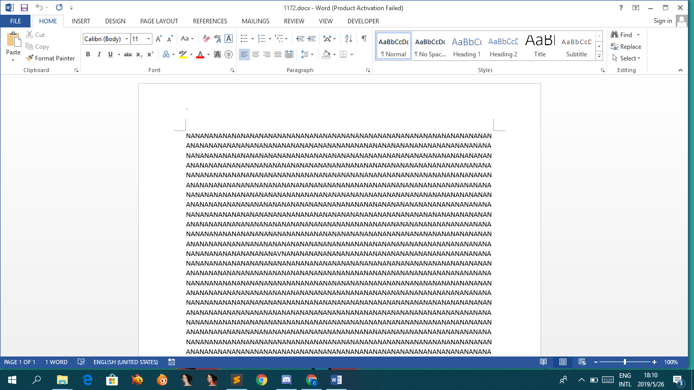
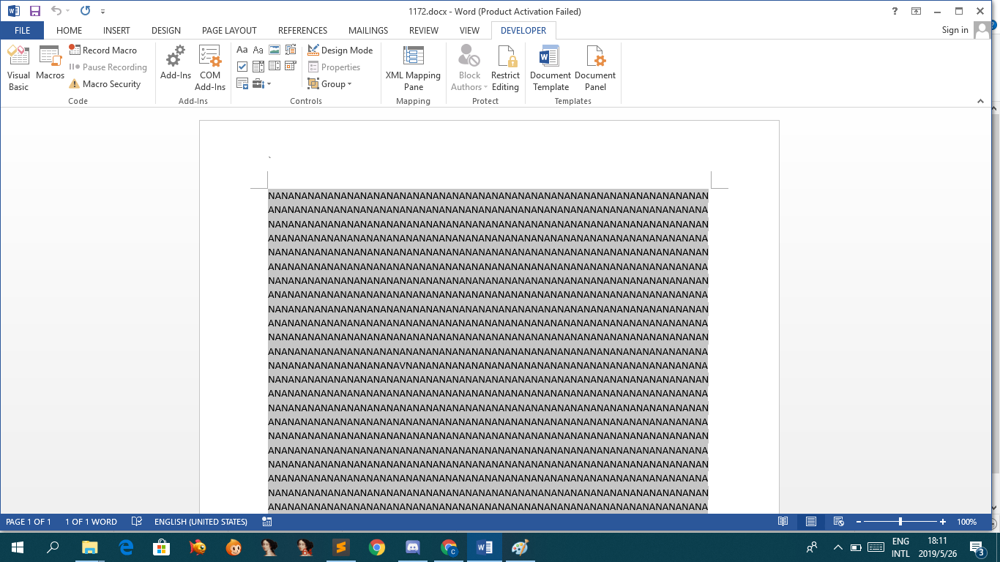
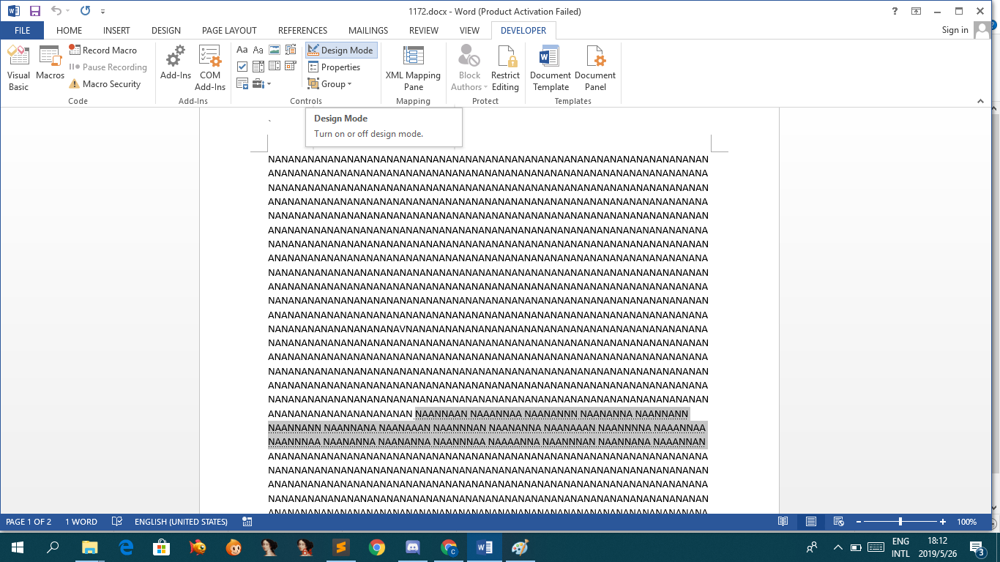

# String

*Forget to copy description*

[1171.docx](1171.docx)

Open in Microsoft Word:


Just a bunch of text with `N` or `A`

After a few checking, we found something in Developer:


After clicking **Design Mode** something have change:


Pretty obvious its binary, because it arrange by 8 characters:
`NAANNAAN NAAANNAA NAANANNN NAANANNA NAANNANN NAANNANN NAANNANA NAANAAAN
NAANNNAN NAANANNA NAANAAAN NAANNNNA NAAANNAA NAANNNAA NAANANNA
NAANANNA NAANNNAA NAAAANNA NAANNNAN NAANNANA NAAANNAN`

Just have to guess which character represent 0 and 1

Its easy to convert it using python:
```python
text = '''NAANNAAN NAAANNAA NAANANNN NAANANNA NAANNANN NAANNANN NAANNANA NAANAAAN
NAANNNAN NAANANNA NAANAAAN NAANNNNA NAAANNAA NAANNNAA NAANANNA
NAANANNA NAANNNAA NAAAANNA NAANNNAN NAANNANA NAAANNAN'''.replace(' ','').replace('\n','').replace('N','0').replace('A','1')

print hex(int(text,2))[2:-1].decode('hex')
```
Result:
```
$ python solve.py
fshiddenbinasciicyber
```
## Flag
> fshiddenbinasciicyber