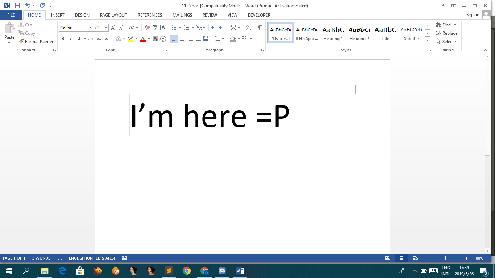
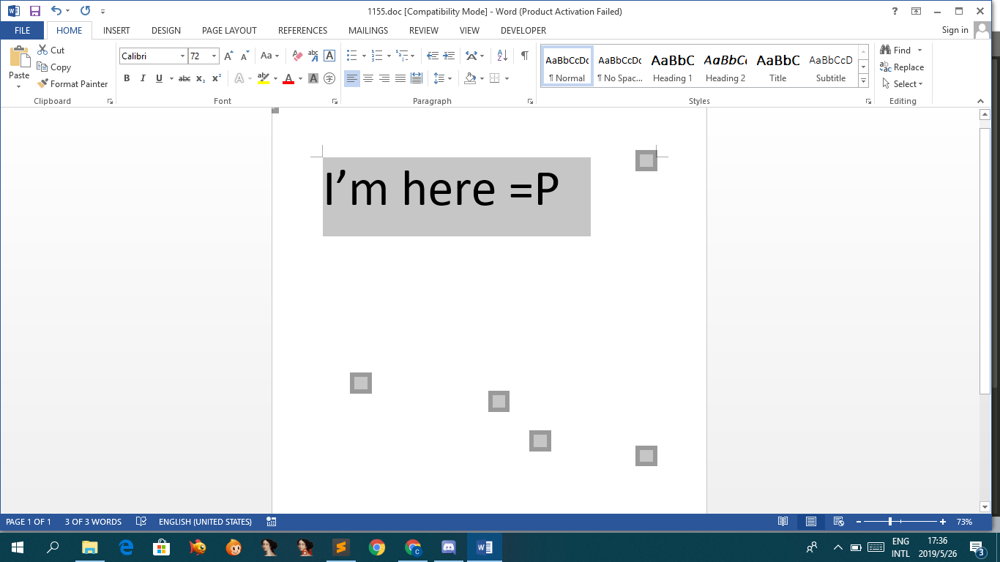
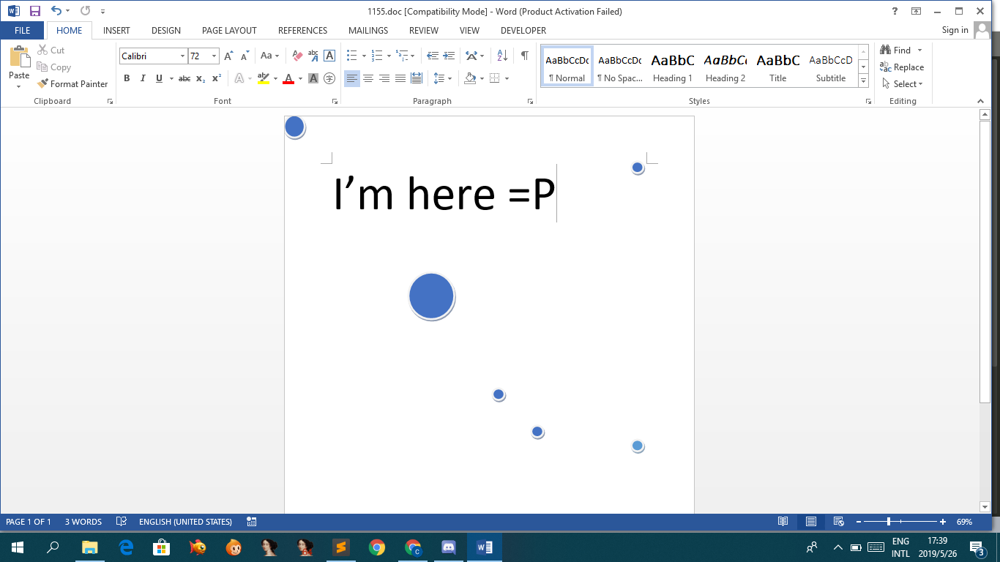
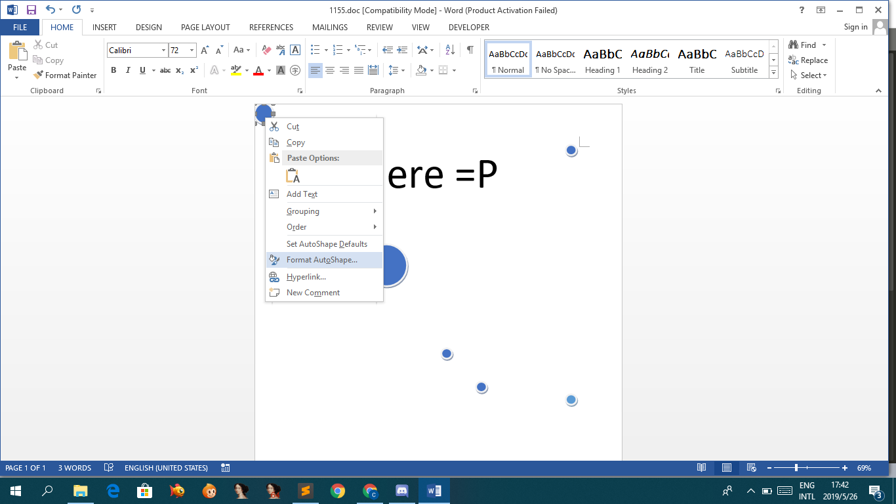
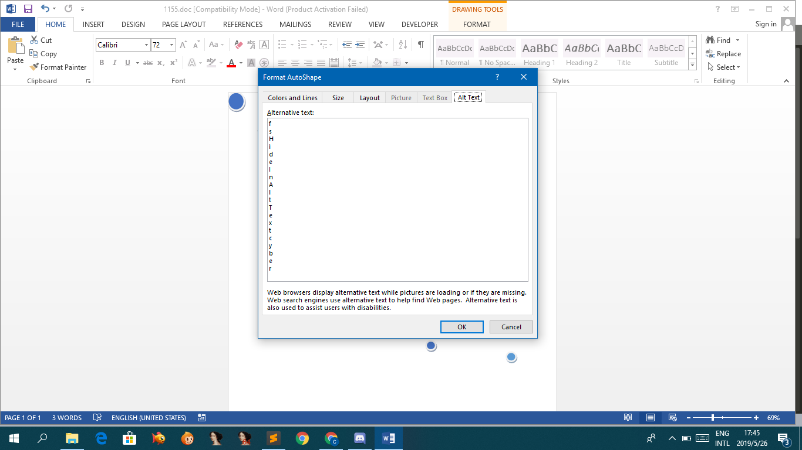

# Word

*Forget to copy description*

[1155.doc](1155.doc)

Open in Microsoft Word:

Press Ctrl + A to find any hidden words:

Found few hidden things!!

But its just circle:

After few checking, we right click the top left circle and click `Format AutoShape`:

Inside tab `Alt Text`, it seems is the flag!!

## Flag
> fsHideInAltTextcyber